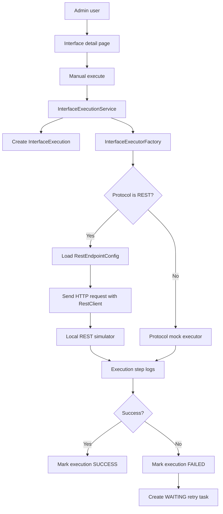
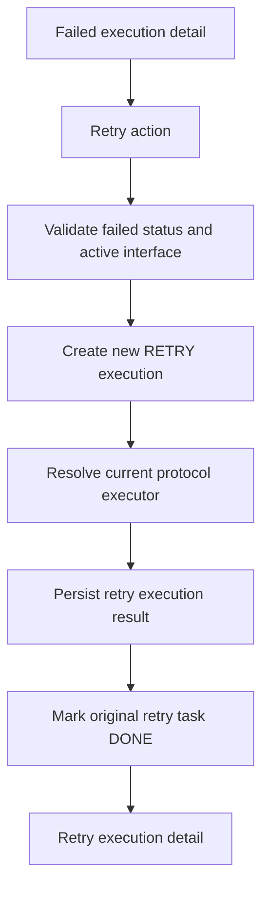

# Architecture

## Architecture Style

Insurance Interface Hub remains a modular monolith: one Spring Boot application with clear package boundaries. Phase 3 keeps the common execution engine protocol-agnostic and replaces only the REST strategy with a real HTTP executor. SOAP, MQ, BATCH, SFTP, and FTP stay mock-driven until later phases.

## Package Map

| Package | Responsibility |
| --- | --- |
| `com.insurancehub.admin.application` | Admin login support and dashboard metrics |
| `com.insurancehub.admin.domain` | Admin user model |
| `com.insurancehub.admin.infrastructure` | Admin persistence adapters |
| `com.insurancehub.admin.presentation` | Login and dashboard controllers |
| `com.insurancehub.interfacehub.application` | Master data use cases |
| `com.insurancehub.interfacehub.application.execution` | Common execution engine, executor contract, factory, result models |
| `com.insurancehub.interfacehub.domain` | Interface, execution, retry, protocol, direction, and status enums |
| `com.insurancehub.interfacehub.domain.entity` | Interface and execution JPA entities |
| `com.insurancehub.interfacehub.infrastructure` | Interface and execution JPA repositories |
| `com.insurancehub.interfacehub.presentation` | Thymeleaf CRUD and execution controllers |
| `com.insurancehub.protocol.rest` | Real REST executor |
| `com.insurancehub.protocol.rest.application` | REST endpoint configuration use cases |
| `com.insurancehub.protocol.rest.domain` | REST-specific enums and entities |
| `com.insurancehub.protocol.rest.infrastructure` | REST configuration repository |
| `com.insurancehub.protocol.rest.presentation` | REST config UI controller and local simulator API |
| `com.insurancehub.protocol.soap`, `mq`, `batch`, `sftp`, `ftp` | Mock executors until their real phases |

## Execution Flow

## REST Adapter Boundary

`InterfaceExecutionService` does not know HTTP details. It records the execution, resolves the executor by `ProtocolType`, persists step logs, and applies success/failure/retry behavior. `RestInterfaceExecutor` owns:

- REST endpoint config lookup
- URL, method, header, body, and timeout handling
- HTTP status and latency capture
- response body and header capture
- conversion of HTTP or client errors into `ExecutionResult`

## Retry Flow

## Security Posture

Spring Security form login is backed by the `admin_user` table. Passwords are stored as BCrypt hashes. `/admin/**` requires authentication. `/simulator/**` is permitted and CSRF-ignored so the local REST executor can call simulator POST endpoints from inside the same application without a browser CSRF token.

## Database Ownership

Flyway owns schema evolution. Phase 3 adds V4 for REST config fields and REST execution inspection fields. Existing migrations are never edited after they are applied.
