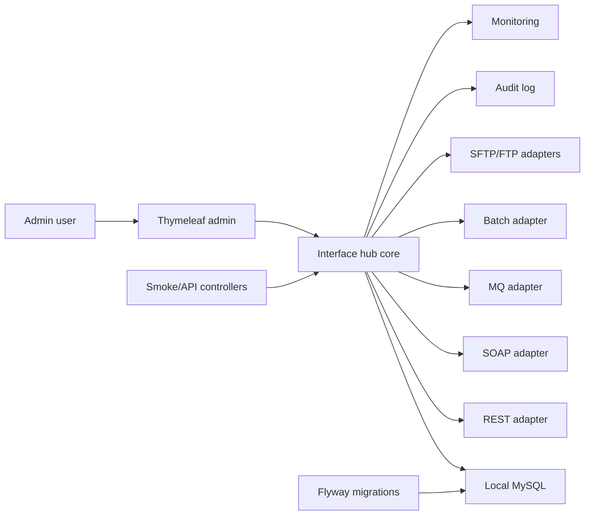

# Architecture

## Architecture Style

Insurance Interface Hub starts as a modular monolith. It is one Spring Boot application with clear internal package boundaries. This keeps local development simple while allowing the codebase to grow toward protocol-specific modules.

See [ADR-001](adr/ADR-001-modular-monolith.md).

## Package Map

| Package | Responsibility |
| --- | --- |
| `com.insurancehub.common` | Shared API contracts, exception handling, base persistence support |
| `com.insurancehub.config` | Spring configuration |
| `com.insurancehub.admin.application` | Admin login support and dashboard use cases |
| `com.insurancehub.admin.domain` | Admin user model |
| `com.insurancehub.admin.infrastructure` | Admin persistence adapters |
| `com.insurancehub.admin.presentation` | Login and dashboard controllers |
| `com.insurancehub.interfacehub.application` | Master data use cases and validation orchestration |
| `com.insurancehub.interfacehub.domain` | Interface, partner, system, protocol, direction, and status model |
| `com.insurancehub.interfacehub.infrastructure` | JPA repositories for master data |
| `com.insurancehub.interfacehub.presentation` | Thymeleaf CRUD controllers and form models |
| `com.insurancehub.protocol.rest` | Future REST adapter |
| `com.insurancehub.protocol.soap` | Future SOAP adapter |
| `com.insurancehub.protocol.mq` | Future MQ/JMS adapter |
| `com.insurancehub.protocol.batch` | Future batch adapter |
| `com.insurancehub.protocol.sftp` | Future SFTP adapter |
| `com.insurancehub.protocol.ftp` | Future FTP adapter |
| `com.insurancehub.monitoring` | Future dashboard metrics and health views |
| `com.insurancehub.audit` | Future audit logging behavior |

## Runtime View

## Dependency Direction

- Admin and protocol modules should depend on the core interface hub model.
- Protocol modules should not depend on each other.
- Common utilities may be used by all modules.
- Audit and monitoring should observe domain events or service calls without owning protocol logic.

## Data Ownership

Flyway owns schema changes. JPA entities added in later phases should map to Flyway-created tables instead of generating schema with Hibernate.

## Security Posture

Phase 1 uses Spring Security form login backed by the `admin_user` table. Passwords are stored as BCrypt hashes. The seeded `admin` account is only for local demos.
