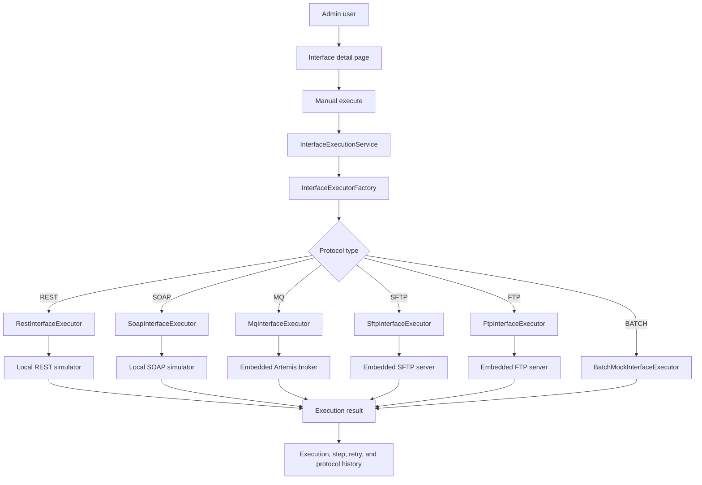

# Architecture

## Architecture Style

Insurance Interface Hub remains a modular monolith: one Spring Boot application with clear package boundaries. Phase 6 keeps the common execution engine protocol-agnostic and replaces SFTP/FTP mock strategies with real file-transfer executors. REST, SOAP, and MQ stay real. BATCH remains mock-driven.

## Package Map

| Package | Responsibility |
| --- | --- |
| `com.insurancehub.admin.*` | Admin login and dashboard |
| `com.insurancehub.interfacehub.application.execution` | Common execution engine, executor contract, factory, result models |
| `com.insurancehub.interfacehub.domain` | Interface, execution, retry, protocol, direction, and status model |
| `com.insurancehub.protocol.rest` | Real REST executor, REST config, and REST simulator |
| `com.insurancehub.protocol.soap` | Real SOAP executor, SOAP config, and SOAP simulator |
| `com.insurancehub.protocol.mq` | Real MQ executor, embedded broker config, MQ channel config, and message history |
| `com.insurancehub.protocol.filetransfer` | Shared SFTP/FTP config, execution, local demo server setup, and transfer history |
| `com.insurancehub.protocol.sftp` | SFTP executor and SFTP client adapter |
| `com.insurancehub.protocol.ftp` | FTP executor and FTP client adapter |
| `com.insurancehub.protocol.batch` | Mock executor until Phase 7 |

## Execution Flow

## File Transfer Boundary

`FileTransferExecutionService` owns:

- active SFTP/FTP configuration lookup
- upload/download request payload parsing
- safe local path resolution under the configured local directory
- SFTP/FTP client selection
- transfer history persistence
- file size, checksum, content summary, latency, and error capture

`LocalFileTransferServerConfig` starts embedded local SFTP and FTP servers when enabled. Runtime demo files are generated under `build/file-transfer-demo`.

`InterfaceExecutionService` remains the orchestration layer and does not know protocol-specific file-transfer details.

## Retry Flow

Retry creates a new execution linked to the original failed execution. REST, SOAP, MQ, SFTP, and FTP retries use their real executors. BATCH uses the mock executor.

## Security Posture

Spring Security form login is backed by the `admin_user` table. Passwords are stored as BCrypt hashes. File-transfer demo credentials are local-only and referenced through `LOCAL_DEMO_FILE_TRANSFER_PASSWORD`; production secret storage is intentionally out of Phase 6.

## Database Ownership

Flyway owns schema evolution. Phase 6 adds V7 for file-transfer config extensions, file transfer history, and SFTP/FTP demo seed data. Existing migrations are never edited after they are applied.
