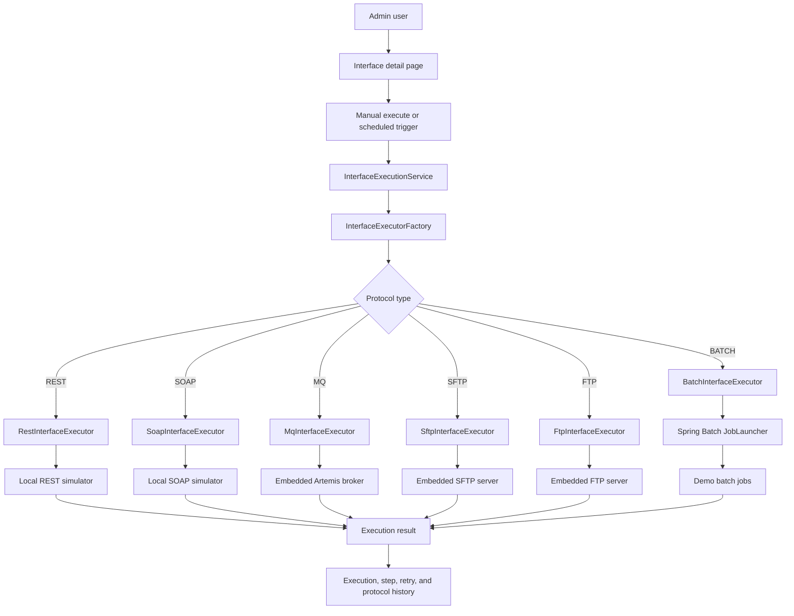

# 아키텍처

## 아키텍처 스타일

Insurance Interface Hub는 하나의 Spring Boot 애플리케이션 안에서 package boundary를 명확히 나눈 modular monolith 구조입니다. Phase 9에서는 구조를 크게 바꾸지 않고, 문서와 테스트를 정리하고 dashboard aggregation을 더 효율적으로 다듬어 제출 준비 상태로 만들었습니다.

공통 실행 엔진은 `interface_execution` row를 먼저 생성한 뒤 프로토콜 executor를 호출하고, 실행 결과를 다시 저장합니다. 이 방식은 HTTP, SOAP, MQ, 파일 전송, Spring Batch 같은 외부/로컬 인프라 호출 동안 하나의 긴 DB transaction을 잡지 않도록 하기 위한 설계입니다.

## Package Map

| Package | 책임 |
| --- | --- |
| `com.insurancehub.admin.*` | 관리자 로그인과 dashboard 진입점 |
| `com.insurancehub.monitoring.*` | 운영 dashboard, monitoring summary, monitoring page controller |
| `com.insurancehub.interfacehub.application.execution` | 공통 실행 엔진, executor contract, factory, result model |
| `com.insurancehub.interfacehub.domain` | 인터페이스, 실행, 재처리, 프로토콜, 방향, 상태 model |
| `com.insurancehub.protocol.rest` | REST executor, REST config, REST simulator |
| `com.insurancehub.protocol.soap` | SOAP executor, SOAP config, SOAP simulator |
| `com.insurancehub.protocol.mq` | MQ executor, embedded broker config, MQ channel config, message history |
| `com.insurancehub.protocol.filetransfer` | SFTP/FTP 공통 설정, 실행, 로컬 demo server setup, transfer history |
| `com.insurancehub.protocol.sftp` | SFTP executor와 SFTP client adapter |
| `com.insurancehub.protocol.ftp` | FTP executor와 FTP client adapter |
| `com.insurancehub.protocol.batch` | Spring Batch executor, job config, scheduler, jobs, run history |

## Monitoring Boundary

`OperationsMonitoringService`는 dashboard aggregation을 담당합니다. 기존 repository를 읽기 전용으로 조회하며 protocol 실행이나 운영 상태 변경을 수행하지 않습니다.

집계 항목은 다음과 같습니다.

- 활성/전체 인터페이스 수
- 오늘 성공/실패 실행 수
- 대기/완료 재처리 수
- 최근 7일 실행 추이
- 실패 상위 인터페이스
- REST, SOAP, MQ, SFTP, FTP, Batch 프로토콜 요약
- MQ 메시지, 파일 전송, Batch 실행 요약

Phase 9에서는 프로토콜별 count query를 반복 호출하던 부분을 grouped repository query로 정리했습니다. dashboard는 여전히 요청 시점에 집계하지만, 오늘/최근 7일처럼 범위를 제한하고 grouping query를 사용해 로컬 데모에서 충분히 빠르게 동작하도록 했습니다.

## Execution Flow

## Batch Boundary

`BatchExecutionService`는 다음 책임을 가집니다.

- 활성 Batch job configuration 조회
- parameter JSON parsing
- Spring Batch job resolution과 launch
- run/step history 저장
- read/write/skip count 수집
- output summary와 error capture

`BatchScheduleService`는 기본적으로 비활성화되어 있습니다. `app.batch.scheduler.enabled=true`로 활성화하면 enabled batch config를 polling하고, 수동 실행과 같은 공통 실행 서비스를 통해 scheduled execution을 생성합니다.

## Retry Flow

재처리는 원본 실패 실행과 연결된 새 실행을 만듭니다. REST, SOAP, MQ, SFTP, FTP, Batch는 모두 실제 executor를 다시 호출합니다. Batch 재처리는 원본 job parameter payload를 사용하므로 같은 실패 조건을 유지하는 audit-friendly rerun 방식입니다.

## Database Ownership

schema 변경은 Flyway가 소유합니다. Phase 9에서는 기존 운영 table을 조회하는 방식으로 dashboard와 문서를 정리했기 때문에 새로운 migration을 추가하지 않았습니다. 이미 적용된 migration은 수정하지 않습니다.

## 최종 제출 관점의 구조

- Admin과 monitoring은 Thymeleaf server-rendered page입니다.
- protocol module은 각자의 설정, 실행, 상세 이력 저장 규칙을 소유합니다.
- 공통 실행 엔진은 execution, step, retry history를 통합 관리합니다.
- 문서와 테스트는 실제 구현된 로컬 데모 동작을 기준으로 작성되어 있습니다.
