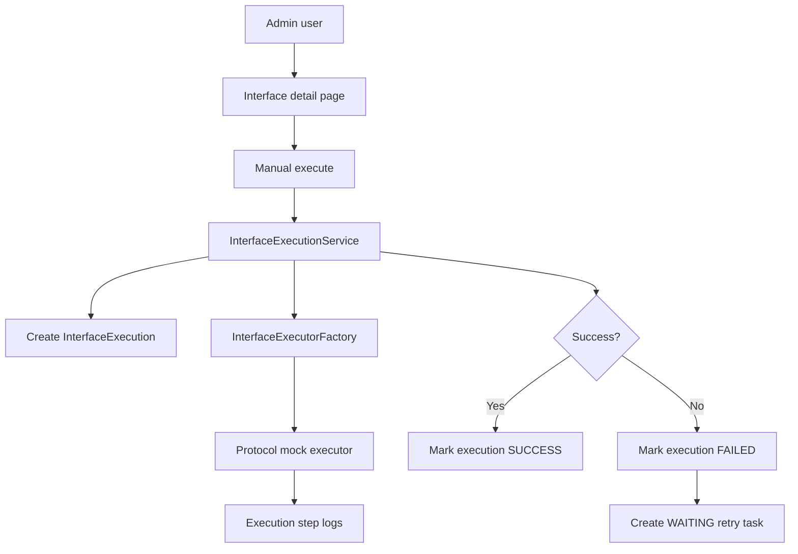
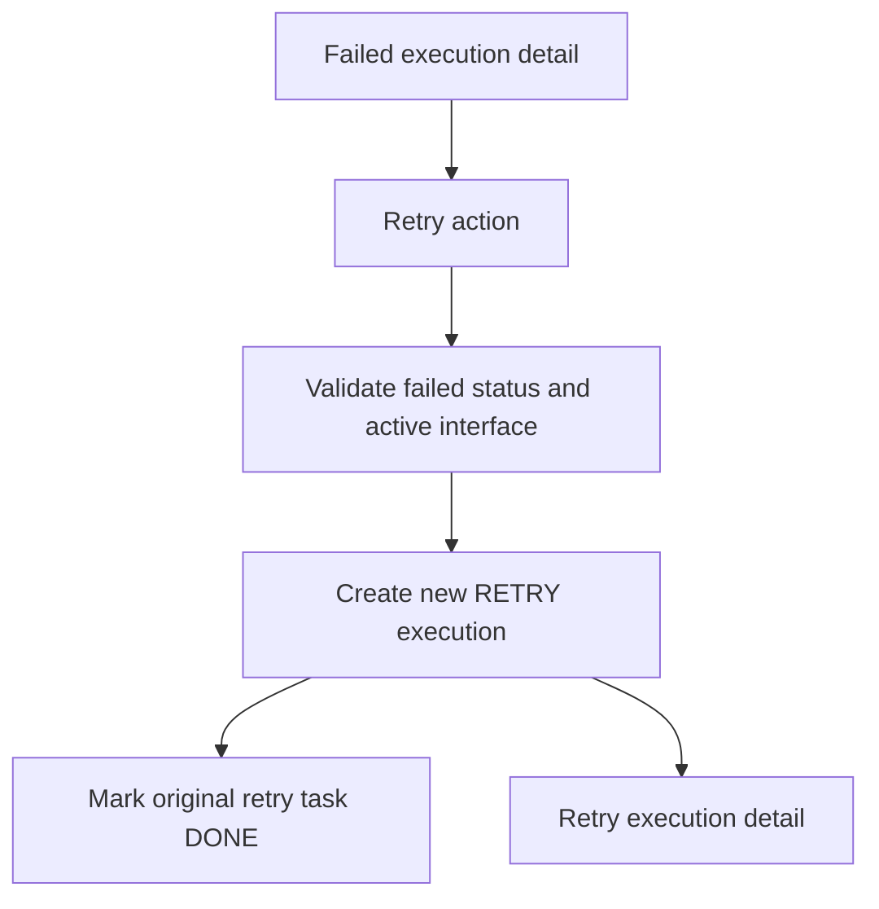

# Architecture

## Architecture Style

Insurance Interface Hub remains a modular monolith: one Spring Boot application with clear internal package boundaries. Phase 2 adds a common execution engine and protocol-specific mock strategies without introducing external workers or separate services.

## Package Map

| Package | Responsibility |
| --- | --- |
| `com.insurancehub.admin.application` | Admin login support and dashboard metrics |
| `com.insurancehub.admin.domain` | Admin user model |
| `com.insurancehub.admin.infrastructure` | Admin persistence adapters |
| `com.insurancehub.admin.presentation` | Login and dashboard controllers |
| `com.insurancehub.interfacehub.application` | Master data use cases |
| `com.insurancehub.interfacehub.application.execution` | Common execution engine, executor contract, factory, result models |
| `com.insurancehub.interfacehub.domain` | Interface, execution, retry, protocol, direction, and status enums |
| `com.insurancehub.interfacehub.domain.entity` | JPA entities |
| `com.insurancehub.interfacehub.infrastructure` | JPA repositories |
| `com.insurancehub.interfacehub.presentation` | Thymeleaf CRUD and execution controllers |
| `com.insurancehub.protocol.*` | Protocol-specific mock executors |

## Execution Flow

## Retry Flow

## Security Posture

Spring Security form login is backed by the `admin_user` table. Passwords are stored as BCrypt hashes. `/admin/**` requires authentication. The seeded `admin` account is only for local demos.

## Database Ownership

Flyway owns schema evolution. Phase 2 adds V3 for execution number, protocol snapshot, payload storage, retry-source linkage, and retry timestamp support.
