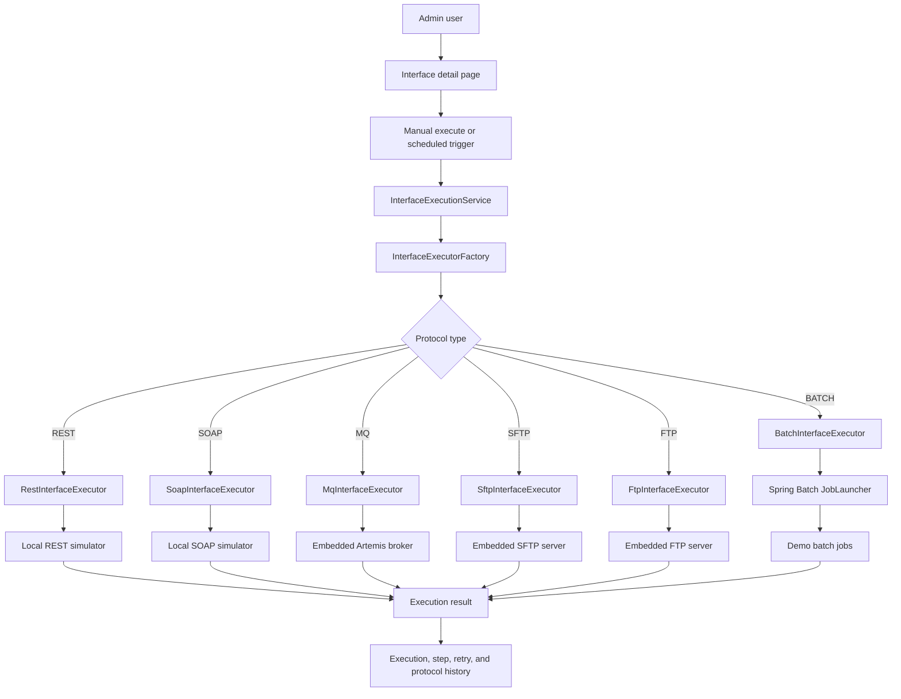

# Architecture

## Architecture Style

Insurance Interface Hub remains a modular monolith: one Spring Boot application with clear package boundaries. Phase 7 completes the real protocol set by replacing the BATCH mock path with Spring Batch jobs while keeping REST, SOAP, MQ, SFTP, and FTP unchanged.

The common execution engine now creates and commits an `interface_execution` row before invoking a protocol executor, then records the result afterward. This avoids holding a database transaction open while calling HTTP, SOAP, MQ, file-transfer, or Spring Batch infrastructure.

## Package Map

| Package | Responsibility |
| --- | --- |
| `com.insurancehub.admin.*` | Admin login and dashboard |
| `com.insurancehub.interfacehub.application.execution` | Common execution engine, executor contract, factory, result models |
| `com.insurancehub.interfacehub.domain` | Interface, execution, retry, protocol, direction, and status model |
| `com.insurancehub.protocol.rest` | Real REST executor, REST config, and REST simulator |
| `com.insurancehub.protocol.soap` | Real SOAP executor, SOAP config, and SOAP simulator |
| `com.insurancehub.protocol.mq` | Real MQ executor, embedded broker config, MQ channel config, and message history |
| `com.insurancehub.protocol.filetransfer` | Shared SFTP/FTP config, execution, local demo server setup, and transfer history |
| `com.insurancehub.protocol.sftp` | SFTP executor and SFTP client adapter |
| `com.insurancehub.protocol.ftp` | FTP executor and FTP client adapter |
| `com.insurancehub.protocol.batch` | Spring Batch executor, job config, scheduler, jobs, and run history |

## Execution Flow

## Batch Boundary

`BatchExecutionService` owns:

- active batch job configuration lookup
- parameter JSON parsing
- Spring Batch job resolution and launch
- run and step history persistence
- read/write/skip count capture
- output summary and error capture

`BatchScheduleService` is disabled by default and can be enabled with `app.batch.scheduler.enabled=true`. It polls enabled batch job configs and launches due jobs through the same common execution service used by manual runs.

## Retry Flow

Retry creates a new execution linked to the original failed execution. REST, SOAP, MQ, SFTP, FTP, and BATCH all rerun through their real executors. Batch retry uses the original job parameter payload.

## Database Ownership

Flyway owns schema evolution. Phase 7 adds V8 for batch config extensions, Spring Batch metadata tables, batch run history, batch step history, and demo batch seed data. Existing migrations are never edited after they are applied.
