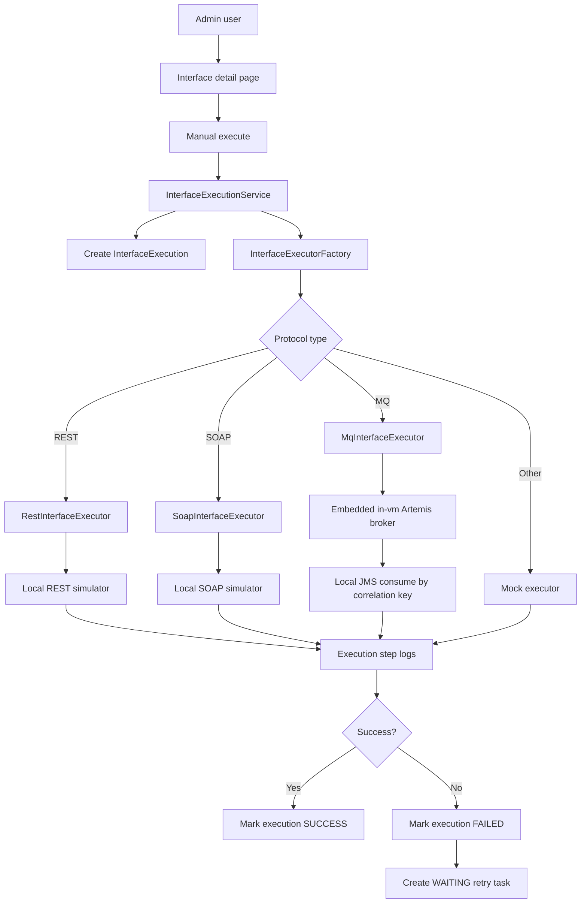

# Architecture

## Architecture Style

Insurance Interface Hub remains a modular monolith: one Spring Boot application with clear package boundaries. Phase 5 keeps the common execution engine protocol-agnostic and replaces only the MQ strategy with a real local JMS executor. REST and SOAP stay real, while BATCH, SFTP, and FTP stay mock-driven.

## Package Map

| Package | Responsibility |
| --- | --- |
| `com.insurancehub.admin.*` | Admin login and dashboard |
| `com.insurancehub.interfacehub.application` | Master data use cases |
| `com.insurancehub.interfacehub.application.execution` | Common execution engine, executor contract, factory, result models |
| `com.insurancehub.interfacehub.domain` | Interface, execution, retry, protocol, direction, and status model |
| `com.insurancehub.interfacehub.infrastructure` | Interface and execution JPA repositories |
| `com.insurancehub.interfacehub.presentation` | Thymeleaf CRUD and execution controllers |
| `com.insurancehub.protocol.rest` | Real REST executor, REST config, and REST simulator |
| `com.insurancehub.protocol.soap` | Real SOAP executor, SOAP config, and SOAP simulator |
| `com.insurancehub.protocol.mq` | Real MQ executor, embedded broker config, MQ channel config, and message history |
| `com.insurancehub.protocol.batch`, `sftp`, `ftp` | Mock executors until their real phases |

## Execution Flow

## MQ Adapter Boundary

`MqInterfaceExecutor` owns:

- active MQ channel config lookup
- text payload selection
- correlation key generation
- publish to the configured local destination
- consume from the same destination by `JMSCorrelationID`
- publish/consume status and message history persistence
- latency, message id, correlation key, and error capture

`LocalMqConfig` starts an embedded in-vm Artemis broker when `app.mq.embedded.enabled=true`. The broker is local to the app process and uses no Docker or external service.

`InterfaceExecutionService` remains the orchestration layer and does not know JMS broker details.

## Retry Flow

Retry still creates a new execution linked to the original failed execution. REST, SOAP, and MQ retries use their real executors. Mock protocols use their mock executors.

## Security Posture

Spring Security form login is backed by the `admin_user` table. Passwords are stored as BCrypt hashes. `/admin/**` requires authentication. `/simulator/**` is permitted and CSRF-ignored so server-side REST and SOAP executors can call local simulator POST endpoints. MQ is internal to the application process in Phase 5 and has no public broker endpoint.

## Database Ownership

Flyway owns schema evolution. Phase 5 adds V6 for MQ channel settings, MQ message history, and local MQ demo seed data. Existing migrations are never edited after they are applied.
