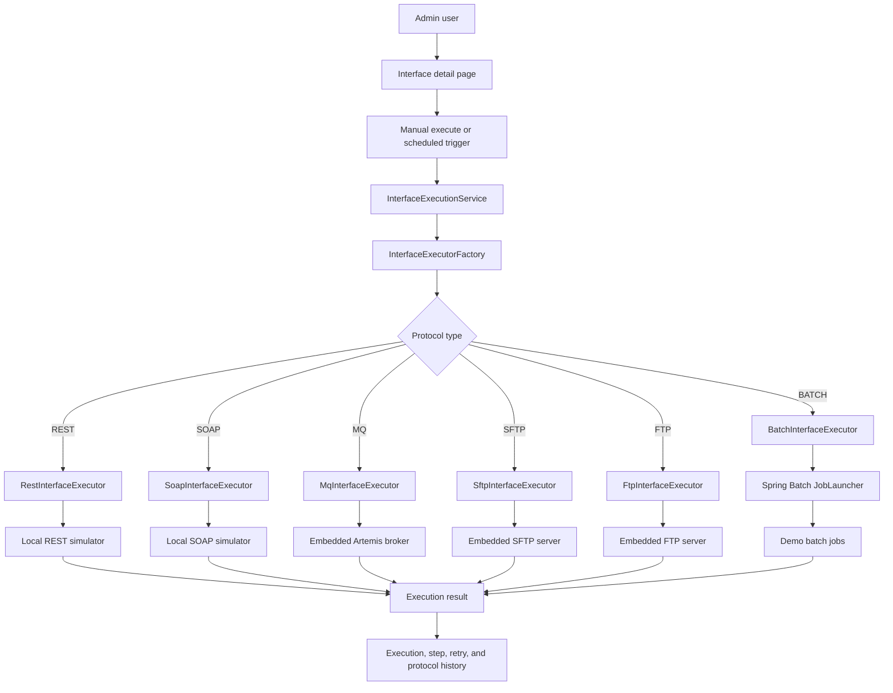

# Architecture

## Architecture Style

Insurance Interface Hub remains a modular monolith: one Spring Boot application with clear package boundaries. Phase 9 keeps the architecture stable and focuses on final readiness: clearer documentation, stronger tests, and performance-conscious dashboard aggregation over the execution, retry, MQ, file-transfer, and batch history already collected by earlier phases.

The common execution engine now creates and commits an `interface_execution` row before invoking a protocol executor, then records the result afterward. This avoids holding a database transaction open while calling HTTP, SOAP, MQ, file-transfer, or Spring Batch infrastructure.

## Package Map

| Package | Responsibility |
| --- | --- |
| `com.insurancehub.admin.*` | Admin login and dashboard entry point |
| `com.insurancehub.monitoring.*` | Operations dashboard, monitoring summaries, and monitoring page controllers |
| `com.insurancehub.interfacehub.application.execution` | Common execution engine, executor contract, factory, result models |
| `com.insurancehub.interfacehub.domain` | Interface, execution, retry, protocol, direction, and status model |
| `com.insurancehub.protocol.rest` | Real REST executor, REST config, and REST simulator |
| `com.insurancehub.protocol.soap` | Real SOAP executor, SOAP config, and SOAP simulator |
| `com.insurancehub.protocol.mq` | Real MQ executor, embedded broker config, MQ channel config, and message history |
| `com.insurancehub.protocol.filetransfer` | Shared SFTP/FTP config, execution, local demo server setup, and transfer history |
| `com.insurancehub.protocol.sftp` | SFTP executor and SFTP client adapter |
| `com.insurancehub.protocol.ftp` | FTP executor and FTP client adapter |
| `com.insurancehub.protocol.batch` | Spring Batch executor, job config, scheduler, jobs, and run history |

## Monitoring Boundary

`OperationsMonitoringService` owns dashboard aggregation. It reads from existing repositories and does not execute protocols or mutate operational state.

It aggregates:

- active and total interface counts
- today success/failure counts
- pending and completed retry counts
- 7-day execution trends
- top failed interfaces
- protocol summaries for REST, SOAP, MQ, SFTP, FTP, and BATCH
- MQ message, file transfer, and batch run summaries

Phase 9 reduces repetitive protocol summary queries by using grouped repository queries for interface counts and execution counts. The dashboard still computes summaries at request time, but bounded windows and grouped counts keep the local demo responsive without adding rollup tables.

The monitoring package depends on protocol history repositories for read models only. Protocol modules still own their execution, configuration, and persistence rules.

## Execution Flow

## Batch Boundary

`BatchExecutionService` owns:

- active batch job configuration lookup
- parameter JSON parsing
- Spring Batch job resolution and launch
- run and step history persistence
- read/write/skip count capture
- output summary and error capture

`BatchScheduleService` is disabled by default and can be enabled with `app.batch.scheduler.enabled=true`. It polls enabled batch job configs and launches due jobs through the same common execution service used by manual runs.

## Retry Flow

Retry creates a new execution linked to the original failed execution. REST, SOAP, MQ, SFTP, FTP, and BATCH all rerun through their real executors. Batch retry uses the original job parameter payload.

## Database Ownership

Flyway owns schema evolution. Phase 9 does not add schema because final dashboard and documentation cleanup use existing operational tables. Existing migrations are never edited after they are applied.

## Final Readiness Boundary

Phase 9 intentionally avoids a major rewrite. The final project remains easy to explain:

- Admin and monitoring are server-rendered Thymeleaf pages.
- Protocol modules own their own configuration and execution detail persistence.
- The common execution engine owns unified execution, step, and retry history.
- Documentation and tests describe the implemented local-demo behavior exactly.
