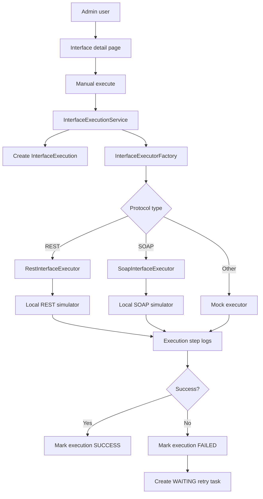

# Architecture

## Architecture Style

Insurance Interface Hub remains a modular monolith: one Spring Boot application with clear package boundaries. Phase 4 keeps the common execution engine protocol-agnostic and replaces only the SOAP strategy with a real SOAP-over-HTTP executor. REST stays real, and MQ, BATCH, SFTP, and FTP stay mock-driven.

## Package Map

| Package | Responsibility |
| --- | --- |
| `com.insurancehub.admin.*` | Admin login and dashboard |
| `com.insurancehub.interfacehub.application` | Master data use cases |
| `com.insurancehub.interfacehub.application.execution` | Common execution engine, executor contract, factory, result models |
| `com.insurancehub.interfacehub.domain` | Interface, execution, retry, protocol, direction, and status model |
| `com.insurancehub.interfacehub.infrastructure` | Interface and execution JPA repositories |
| `com.insurancehub.interfacehub.presentation` | Thymeleaf CRUD and execution controllers |
| `com.insurancehub.protocol.rest` | Real REST executor, REST config, and REST simulator |
| `com.insurancehub.protocol.soap` | Real SOAP executor, SOAP config, and SOAP simulator |
| `com.insurancehub.protocol.mq`, `batch`, `sftp`, `ftp` | Mock executors until their real phases |

## Execution Flow

## SOAP Adapter Boundary

`SoapInterfaceExecutor` owns:

- SOAP endpoint config lookup
- SOAP request XML selection
- endpoint URL, SOAPAction, and timeout handling
- SOAP-over-HTTP POST execution
- HTTP status, response XML, response headers, and latency capture
- conversion of SOAP faults and client errors into `ExecutionResult`

`InterfaceExecutionService` remains the orchestration layer and does not know SOAP network details.

## Retry Flow

Retry still creates a new execution linked to the original failed execution. REST and SOAP retries use their real executors. Mock protocols use their mock executors.

## Security Posture

Spring Security form login is backed by the `admin_user` table. Passwords are stored as BCrypt hashes. `/admin/**` requires authentication. `/simulator/**` is permitted and CSRF-ignored so server-side REST and SOAP executors can call local simulator POST endpoints.

## Database Ownership

Flyway owns schema evolution. Phase 4 adds V5 for SOAP config fields, a generic `protocol_action` execution field, and local SOAP demo seed data. Existing migrations are never edited after they are applied.
