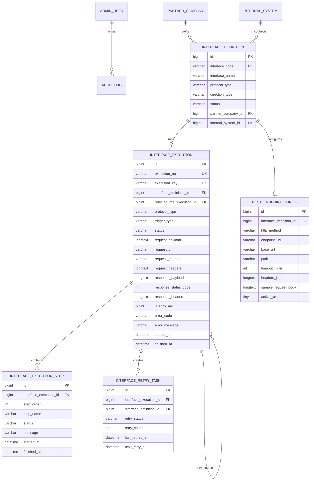

# ERD

Phase 3 extends the execution schema through `V4__phase_3_real_rest_integration.sql`.

## Logical ERD

## Phase 3 Migration Notes

V4 adds:

- `rest_endpoint_config.base_url`
- `rest_endpoint_config.path`
- `rest_endpoint_config.headers_json`
- `rest_endpoint_config.sample_request_body`
- `rest_endpoint_config.active_yn`
- `interface_execution.request_url`
- `interface_execution.request_method`
- `interface_execution.request_headers`
- `interface_execution.response_status_code`
- `interface_execution.response_headers`
- `interface_execution.latency_ms`
- sample REST config for `IF_REST_POLICY_001`

The legacy `rest_endpoint_config.endpoint_url` column remains populated for compatibility with the Phase 0 baseline. The application uses `base_url + path` and synchronizes `endpoint_url`.

## Status Enums

Execution status:

- PENDING
- RUNNING
- SUCCESS
- FAILED

Retry status:

- WAITING
- DONE
- CANCELLED
