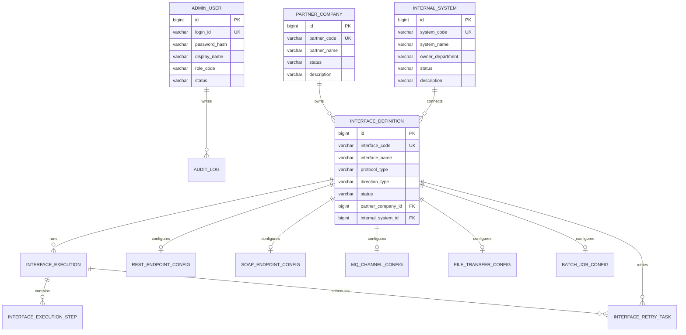

# ERD

Phase 1 uses the Phase 0 baseline tables and adds a V2 migration for admin login and master CRUD fields.

## Logical ERD

## Phase 1 Migration Notes

`V2__phase_1_admin_master_crud.sql` adds:

- `admin_user.password_hash`
- `admin_user.description`
- `partner_company.status`
- `partner_company.description`
- `internal_system.status`
- `internal_system.description`
- `interface_definition.status`
- supporting status indexes
- local demo seed data

## Master Data Rules

- `partner_company.partner_code` is unique.
- `internal_system.system_code` is unique.
- `interface_definition.interface_code` is unique.
- `interface_definition.status` is the Phase 1 enable/disable source of truth.
- Legacy `active_yn` and `enabled_yn` columns remain synchronized by the JPA entity methods for now.

## Future Adjustments

Later phases may add:

- Credential alias tables
- Protocol-specific create/edit screens
- File transfer history detail
- Payload metadata tables
- Batch run parameter tables
- Dashboard aggregation tables
- Audit event persistence from services
