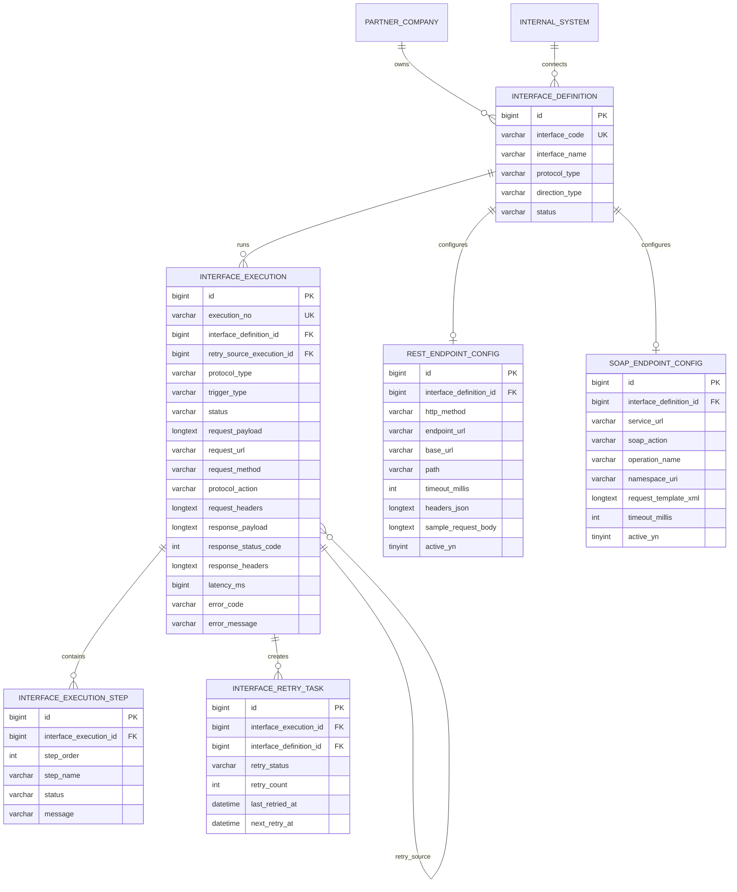

# ERD

Phase 4 extends the schema through `V5__phase_4_real_soap_integration.sql`.

## Logical ERD

## Phase 4 Migration Notes

V5 adds:

- `soap_endpoint_config.operation_name`
- `soap_endpoint_config.request_template_xml`
- `soap_endpoint_config.active_yn`
- `interface_execution.protocol_action`
- sample SOAP interface `IF_SOAP_POLICY_001`
- sample SOAP config for the local policy inquiry simulator

The existing `soap_endpoint_config.service_url` column is mapped as the SOAP endpoint URL in application code.
