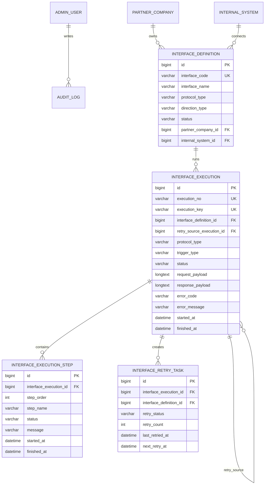

# ERD

Phase 2 extends the Phase 0 execution tables through `V3__phase_2_execution_engine.sql`.

## Logical ERD

## Phase 2 Migration Notes

V3 adds:

- `interface_execution.execution_no`
- `interface_execution.retry_source_execution_id`
- `interface_execution.protocol_type`
- `interface_execution.request_payload`
- `interface_execution.response_payload`
- `interface_retry_task.last_retried_at`
- indexes for execution number, protocol, retry source, and retry task status

## Status Enums

Execution status:

- PENDING
- RUNNING
- SUCCESS
- FAILED

Retry status:

- WAITING
- DONE
- CANCELLED
