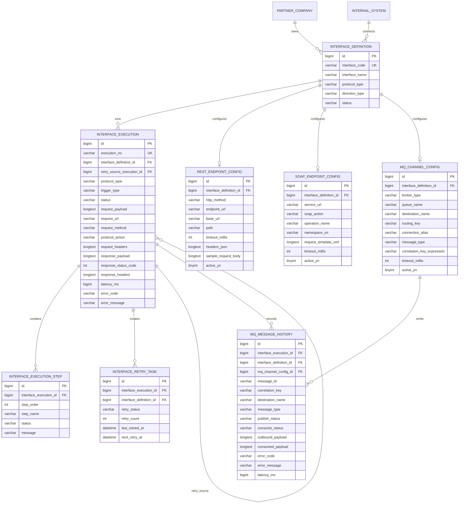

# ERD

Phase 5 extends the schema through `V6__phase_5_real_mq_integration.sql`.

## Logical ERD

## Phase 5 Migration Notes

V6 adds:

- `mq_channel_config.destination_name`
- `mq_channel_config.message_type`
- `mq_channel_config.correlation_key_expression`
- `mq_channel_config.timeout_millis`
- `mq_channel_config.active_yn`
- `mq_message_history`
- sample MQ interface `IF_MQ_POLICY_001`
- sample MQ config for the local embedded Artemis demo destination

`mq_message_history` separates producer and consumer outcomes with `publish_status` and `consume_status`. This keeps a successful publish but failed consumer processing understandable in the admin UI.
