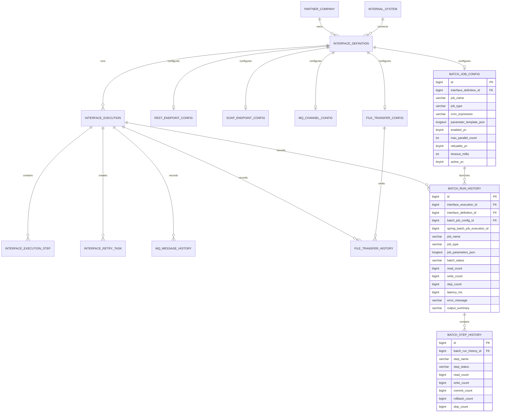

# ERD

최종 Phase 9 schema는 `V8__phase_7_real_batch_integration.sql`까지의 Flyway migration chain으로 구성됩니다. Phase 9에서는 schema를 추가하지 않았고, 기존 운영 table을 기반으로 dashboard와 monitoring을 구성했습니다.

table 이름과 column 이름은 실제 DB 객체명이므로 번역하지 않습니다.

## Logical ERD

## 주요 Table Group

| 구분 | Tables |
| --- | --- |
| 관리자/master data | `admin_user`, `partner_company`, `internal_system`, `interface_definition` |
| 공통 실행 | `interface_execution`, `interface_execution_step`, `interface_retry_task` |
| 프로토콜 설정 | `rest_endpoint_config`, `soap_endpoint_config`, `mq_channel_config`, `file_transfer_config`, `batch_job_config` |
| 프로토콜 이력 | `mq_message_history`, `file_transfer_history`, `batch_run_history`, `batch_step_history` |
| 감사/framework | `audit_log`, Spring Batch metadata tables |

## 설계 의도

- `interface_definition`은 모든 프로토콜 실행의 기준 master data입니다.
- 각 프로토콜 설정 table은 `interface_definition`과 1:1에 가까운 관계를 가집니다.
- `interface_execution`은 공통 실행 이력의 중심 table입니다.
- 프로토콜별 상세 결과는 `mq_message_history`, `file_transfer_history`, `batch_run_history` 같은 별도 table에 저장합니다.
- `interface_retry_task`는 실패 실행을 기준으로 재처리 대기/완료/취소 상태를 관리합니다.

## Migration Notes

`V8__phase_7_real_batch_integration.sql`은 다음 항목을 추가합니다.

- Batch job type, parameter, retryability, timeout, active flag
- `batch_run_history`
- `batch_step_history`
- Flyway가 관리하는 Spring Batch metadata tables
- sample batch interfaces `IF_BATCH_SETTLEMENT_001`, `IF_BATCH_RETRY_AGG_001`

Spring Batch metadata table은 framework 운영 table입니다. 포트폴리오에서 운영자가 보는 Batch 이력은 `batch_run_history`와 `batch_step_history`에 저장됩니다.

Phase 9에서는 새로운 DB 객체를 추가하지 않았습니다. dashboard와 monitoring은 repository query와 view model을 통해 기존 table을 읽습니다.
