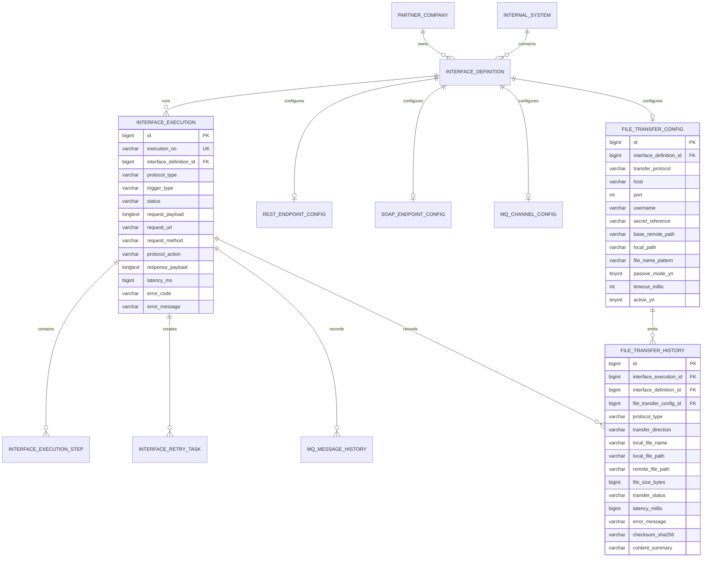

# ERD

Phase 6 extends the schema through `V7__phase_6_real_file_transfer_integration.sql`.

## Logical ERD

## Phase 6 Migration Notes

V7 adds:

- `file_transfer_config.host`
- `file_transfer_config.username`
- `file_transfer_config.secret_reference`
- `file_transfer_config.base_remote_path`
- `file_transfer_config.timeout_millis`
- `file_transfer_config.active_yn`
- `file_transfer_history`
- sample SFTP interface `IF_SFTP_POLICY_001`
- sample FTP interface `IF_FTP_POLICY_001`

`file_transfer_history` records transfer direction, local and remote paths, size, checksum, latency, status, and errors so operators can inspect file-transfer results from execution detail pages.
